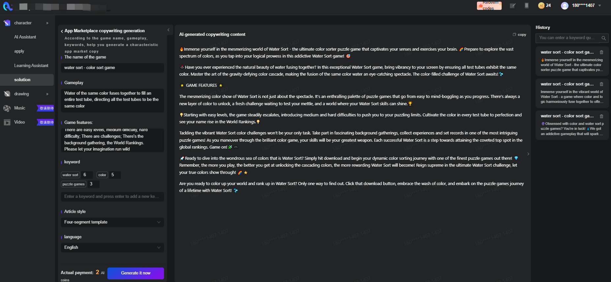

# ASO Text-Generating Tool

[](https://github.com/SimengLi1998/ASOTextGenerator)
[](https://github.com/SimengLi1998/ASOTextGenerator/stargazers)
[](https://github.com/SimengLi1998/ASOTextGenerator/issues)

The **ASO Text-Generating Tool** (ASO AI-Powered Content Generation Framework) is a machine learning-powered application that automates the process of creating optimized product descriptions and app store listings.

This project is a part of the Zhiqite AIGC Creative Platform, an innovative AI-generated content (AIGC) platform leveraging GPT-3.5 for generating optimized text, images, videos, and audio content. This tool, focusing on Application Store Optimization (ASO), is specifically designed to enhance the visibility of gaming apps on platforms like Google Play, using data-driven insights and machine learning techniques.

## Overview

The ASO Text-Generating Tool aims to improve the organic visibility of mobile apps by generating optimized marketing copy. The project involved:

1. Conducting ASO strategy experiments on Google Play.
2. Reverse engineering the GP recommendation system.
3. Developing a copy generation tool using GPT-3.5.
4. Implementing high-concurrency support with FastAPI and streaming outputs.

By leveraging machine learning and statistical analysis, the tool identifies key factors influencing app exposure and optimizes the generated text to enhance chances of featuring in recommendation lists, significantly boosting organic downloads.

## Key Features

- **Highly Customizable Templates**: Tailor the content to fit various app descriptions and features.
- **AI-Driven Content Optimization**: Utilize advanced AI models to generate and optimize copy for better visibility and organic downloads.
- **Multilingual Support**: Generate content in multiple languages, expanding your app's reach globally.
- **Concurrency Handling**: Built to handle high-concurrency requests, ensuring efficient service delivery.
- **Real-time Analytics**: Gain insights into the performance of your content and make data-driven decisions.

## Technical Details

The ASO Text-Generating Tool is built using the following technologies:

- **Backend**: Python, FastAPI, OpenAI, Uvicorn
- **Frontend**: React, HTML, CSS, JavaScript
- **Database**: MongoDB
- **Deployment**: Docker, Kubernetes

## Getting Started

To run the ASO Text-Generating Tool locally, follow these steps:

1. Clone the repository: `git clone https://github.com/SimengLi1998/ASOTextGenerator.git`
2. Install the required dependencies: `pip install -r requirements.txt`
3. Set the necessary environment variables (API keys, database credentials, etc.).
4. Run the application: `uvicorn main:app --reload`
5. Access the tool at `http://localhost:7805/service/aso`

### Screenshots



### Project Structure

```text
├── Dockerfile
├── LICENSE
├── __init__.py
├── config.conf
├── datamodel
│   ├── __init__.py
│   ├── aso_model.py
│   └── custom_error.py
├── fastapi_require.txt
├── main.py
├── requirements.txt
└── routers
    ├── __init__.py
    ├── api_requestor.py
    ├── service.py
    └── templete.py
```

- **Dockerfile**: Docker configuration for the project.
- **main.py**: Entry point for the FastAPI application.
- **config.conf**: Configuration file for environment variables and settings.
- **requirements.txt**: Python dependencies.
- **fastapi_require.txt**: Additional dependencies for FastAPI.
- **datamodel/**: Contains data models for API requests and custom error handling.
- **routers/**: API route handlers and templates for prompt generation.

## Usage and Integration

The **ASO Text-Generating Tool** is available as a web application, accessible at [https://zhiqiteai.cn/aiWeb](https://zhiqiteai.cn/aiWeb). Users can log in to the platform and access the "Text" section, where they can generate ASO-optimized copy for their apps and products.

The tool can also be integrated into other systems and workflows through a RESTful API. Developers can access the API documentation and integration guide at [https://create.zhiqiteai.cn/login](https://create.zhiqiteai.cn/login).

### API Endpoints

The application exposes the following API endpoints:

#### 1. ASO Text Generation

- **Endpoint**: `/service/aso`
- **Method**: `POST`
- **Request Body**: `AsoInput` model, containing game name, description, features, keywords, language, and style.
- **Response**: `PromptModel`, containing the generated app store text.

#### 2. ASO Text Generation (Streaming)

- **Endpoint**: `/service/aso_stream`
- **Method**: `POST`
- **Request Body**: `AsoInput` model, similar to the previous endpoint.
- **Response**: Streaming response with the generated app store text.

#### 3. Code Generation

- **Endpoint**: `/service/code_dbtstream`
- **Method**: `POST`
- **Request Body**: `CodeInput` model, containing task ID, code language, and scene descriptions.
- **Response**: Streaming response with the generated code snippets.

#### 4. Text Content Classification

- **Endpoint**: `/service/classify`
- **Method**: `POST`
- **Request Body**: `TextContent` model, containing the text to be classified.
- **Response**: List of classification results.

For detailed API usage, explore the API documentation provided by FastAPI at `http://localhost:7800/docs`.

## Contributing

Contributions are welcome! Please follow these steps:

1. Fork the repository.
2. Create a new branch (`git checkout -b feature-branch`).
3. Make your changes.
4. Commit your changes (`git commit -am 'Add new feature'`).
5. Push to the branch (`git push origin feature-branch`).
6. Create a new Pull Request.

Please ensure your changes adhere to the project's coding standards and include relevant tests.

## License

This project is licensed under the MIT License. See the [LICENSE](LICENSE) file for details.

Feel free to reach out if you have any questions or need further assistance!
